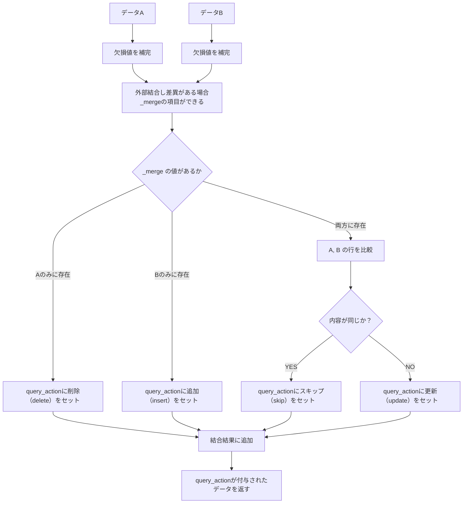

# 概要

今回は、PythonのPandasを使って、差分を抽出するDiffツールを作成したいと思います。

データフレームに対して、「**追加（insert）**」「**更新（update）**」「**削除（delete）**」「**変更なし（skip）**」といったアクションを判別し、差分付きのデータフレームを生成します。

# データサンプル

プログラムの紹介する前に、実際のデータを使って差分抽出のイメージを説明します。
「データA」から「データB」へと変更された際に、どのような差分結果が発生するかを見ていきます。

### データA

比較元のデータフレームです。

| id | name    | age |
| -- | ------- | --- |
| 1  | Alice   | 30  |
| 2  | Bob     | 25  |
| 3  | Charlie | 40  |

### データB

比較対象のデータフレームです。

| id | name  | age |
| -- | ----- | --- |
| 1  | Alice | 31  |
| 2  | Bob   | 25  |
| 4  | Diana | 22  |


### 結果データ

Bデータがベースに差分情報が付与されたデータフレームになります。
query_action 列に、「insert（追加）」「update（更新）」「delete（削除）」「skip（変更なし）」のいずれかが入ります。


| id | name    | age | query\_action |
| -- | ------- | --- | ------------- |
| 1  | Alice   | 31  | update        |
| 2  | Bob     | 25  | skip          |
| 3  | Charlie | 40  | delete        |
| 4  | Diana   | 22  | insert        |


# フローチャート

次にフローチャートです。
pandasのmergeを使うだけでは、カラムごとの変化が分からないため、以下のようなフローチャートになります。



# プログラム

```python
import pandas as pd
from pandas import DataFrame
from typing import Union

def generate_diff_dataframe(
    df_A: DataFrame,
    df_B: DataFrame,
    key_column: Union[str, list[str]]
) -> DataFrame:
    """
    差分データの生成
    Args:
        df_A (DataFrame): 比較元のデータフレーム
        df_B (DataFrame): 比較対象のデータフレーム
        key_column (str | list[str]): 主キー列名または複数主キーのリスト
    Returns:
        DataFrame: Bの構成に query_action 列を加えた差分付きデータフレーム
    """

    # 欠損値を補完
    df_A = df_A.fillna("").copy()
    df_B = df_B.fillna("").copy()

    # outer join による統合とマージ情報の付与
    merged = pd.merge(df_A, df_B, on=key_column, how="outer", suffixes=('_A', '_B'), indicator=True)

    # 結果格納用リスト
    diff_rows = []

    # 各行の比較
    for _, row in merged.iterrows():
        key = row[key_column]
        if row['_merge'] == 'left_only':
            # Aにしかない → delete
            delete_row = df_A[df_A[key_column] == key].iloc[0].copy()
            delete_row['query_action'] = 'delete'
            diff_rows.append(delete_row)
        elif row['_merge'] == 'right_only':
            # Bにしかない → insert
            insert_row = df_B[df_B[key_column] == key].iloc[0].copy()
            insert_row['query_action'] = 'insert'
            diff_rows.append(insert_row)
        else:
            # 両方にある → 値を比較して update or skip
            row_A = df_A[df_A[key_column] == key].iloc[0]
            row_B = df_B[df_B[key_column] == key].iloc[0]

            if row_A.equals(row_B):
                action = 'skip'
            else:
                action = 'update'

            updated_row = row_B.copy()
            updated_row['query_action'] = action
            diff_rows.append(updated_row)

    # カラム順はBに合わせ、query_actionを最後に
    result_df = pd.DataFrame(diff_rows).fillna("").copy()
    columns_order = list(df_B.columns) + ['query_action']
    return result_df[columns_order]
```

# コード解説

## 1. 欠損値の補完とコピー

NaN を空文字に変換しています（比較処理で NaN があると判定ができないため）

```python
df_A = df_A.fillna("").copy()
df_B = df_B.fillna("").copy()
```

## 2. 外部結合（outer join）で2つのデータフレームを結合

AとBを key_column（主キー）で外部結合（outer join）し、各行がどこから来たかを _merge 列に記録します

| _merge      | 説明                  | query_action |
|-------------|-----------------------|---------------|
| left_only   | A にしか存在しない   | delete        |
| right_only  | B にしか存在しない   | insert        |
| both        | A と B の両方に存在  | update または skip |


```python
merged = pd.merge(df_A, df_B, on=key_column, how="outer", suffixes=('_A', '_B'), indicator=True)
```

## 3. 各行ごとの差分チェック

データのレコードに対し一行ずつ処理を行います。

```python
for _, row in merged.iterrows():
    ...
```


### ・削除（delete）の処理

`_merge` に `left_only` が格納されていた場合は、削除（delete）として処理

```python
if row['_merge'] == 'left_only':
    delete_row = df_A[df_A[key_column] == key].iloc[0].copy()
    delete_row['query_action'] = 'delete'
```

### ・追加（insert）の処理

`_merge` に `left_only` が格納されていた場合は、削除（insert）として処理


```python
elif row['_merge'] == 'right_only':
    insert_row = df_B[df_B[key_column] == key].iloc[0].copy()
    insert_row['query_action'] = 'insert'
```

### ・スキップ（skip）と更新（update）の処理

`_merge` 列に `both` が含まれている場合は、A・B両方に存在する行として扱われます。
このとき、行全体を比較し、内容が同じであれば「スキップ（skip）」、異なっていれば「更新（update）」として判定します。
判定には B側のデータをベース に使用しています。

なお、現時点では「どの列に差分があるか」までは判定していません。
今後、必要に応じてこの点も改良していければと思っています。

```python
else:
    row_A = df_A[df_A[key_column] == key].iloc[0]
    row_B = df_B[df_B[key_column] == key].iloc[0]

    if row_A.equals(row_B):
        action = 'skip'
    else:
        action = 'update'

    updated_row = row_B.copy()
    updated_row['query_action'] = action
```

## 4. データフレームを作成し結果を返す

カラム順はBの列を基本にして、最後に query_action を追加。

```python
result_df = pd.DataFrame(diff_rows).fillna("").copy()
columns_order = list(df_B.columns) + ['query_action']
return result_df[columns_order]
```

# おわりに

今回は、Pandasを使って簡単なDiffツールを作成してみました。
なんとなくですが、世の中のDiffツールの仕組みが少し分かった気がします（…たぶん気のせいです）。

こちらのGithubのリポジトリで管理しているので気になる方は使ってみてください。

https://github.com/ishi720/generate_diff_dataframe


ここまで読んで頂きありがとうございました。
